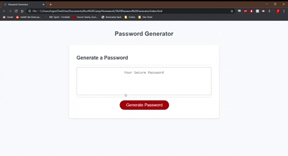

# Password Generator
Using javaScript to generate a random password based on user responses to a series of prompts.

## Link
[Link to deployed site](https://tsgrewing.github.io/Password_Generator/)

## Demo

## User input determines password parameters.
The uses chooses a length, between 8 and 128 characters. 
They then go through a series of prompts to determine what types of characters will be included. 
Any character type that is chosen will be present in the final password, and the frequency of each type of character is distributed by percentage of possibilities. (there will be fewer numbers since there are fewer options of that type of character to pull from)
The final result is then shuffled and returned to the user in the box above the generate password button.
